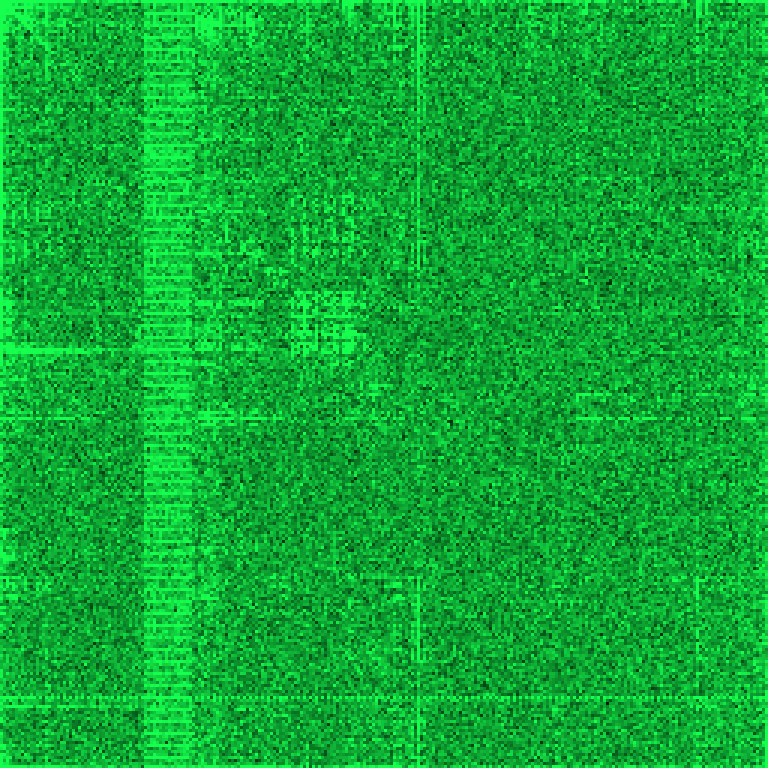

# digraph

Byte-pair (**digraph**) histograms for binary visualization: turn a byte stream into a 256×256 frequency map so structure shows up as patterns in a heatmap.

You pass bytes (from a file, network, or memory) and use one of different renderers to render a visualization.

Useful to reverse engineer unknown byte streams.



## Why digraphs?

Sequential byte pairs `(b[i], b[i+1])` form a compact “fingerprint” of raw data: repeated regions, alignment, text-like ranges, and mixed blobs often produce recognizable shapes when pair counts are shown as an image.

## What this library does

- Builds a 256×256 table: cell `(x, y)` counts how often byte `x` is immediately followed by byte `y`.
- **Layout for heatmaps**: row index = first byte of the pair, column index = second byte (CantorDust-style two-tuple orientation used in many binary-viz tools).
- **Modes** (`Mode`): overlapping pairs `(0,1), (1,2), …` or non-overlapping `(0,1), (2,3), …`.
- **Rendering**: terminal ASCII heatmap, raw RGBA pixmap, PNG (`image` feature) and SVG (`svg` feature).
- **Optional** `serde` for serializing `Digraph` / `Mode`.

## Quick start

```toml
[dependencies]
digraph = { path = "." }   # or version from crates.io when published
```

```rust
use digraph::{AsciiParams, Digraph, Mode};

fn main() {
    let d = Digraph::from_bytes_with_mode(b"hello world", Mode::Overlapping);
    let ascii = d.to_ascii(AsciiParams::default());
    println!("{ascii}");
}
```

With default features you can also rasterize without the `image` crate:

```rust
use digraph::{Digraph, Mode, RenderParams};

let d = Digraph::from_bytes_with_mode(b"hello", Mode::Overlapping);
let pixmap = d.to_rgba_pixels(RenderParams::default());
assert_eq!(pixmap.width, pixmap.height);
```

## Features

| Feature   | Enables |
|-----------|---------|
| *(none)* | Core digraph, ASCII, raw RGBA pixmap |
| `image`  | PNG helpers, `RgbaImage` via `image` |
| `svg`    | SVG heatmap strings |
| `serde`  | `Serialize` / `Deserialize` on core types |

## Examples (from repo root) 

```powershell
cargo run --example ascii
cargo run --example ascii -- path/to/file.bin

cargo run --example png --features image
cargo run --example png --features image -- path/to/file.bin out.png viridis

cargo run --example svg --features svg
cargo run --example svg --features svg -- path/to/file.bin out.svg viridis
```

## Further reading

- [Battelle publishes open-source binary visualization tool](https://inside.battelle.org/blog-details/battelle-publishes-open-source-binary-visualization-tool) 